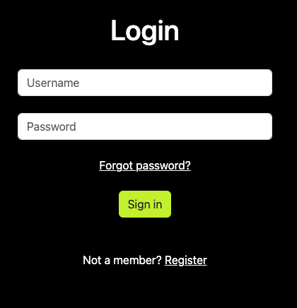

# Show your Keyboard

### A community website for all the mechanical keyboard lovers out here. 
### Create a user and, post your keyboard, like and comment on others' posts.
      

### Link to the finished site: 
_____________________________________________________________________________
## Am I responsive image 

_____________________________________________________________________________
## Content:
- ### Project Goals and target audience
    - [Achieved](#achieved)
    - [Future implements](#future-projects)
    - [Audience](#audience)
- ### Project management
    - [Project boards](#github-project-board-user-stories-issues)
    - [Site user goal](#site-user-goal)
    - [Site owner goal](#site-owner-goal)
    - [User Stories](#user-stories)
- ### Wireframes and templates
    - [Lucid Chart](#lucid-chart)
    - [DrawSql Chart](#drawsql-chart)
    - [Database Structure](#database-and-structure)
    - [Balsamiq Template](#balsamiq-templates)
- ### Design and Features
    - [Design and Features](#design-and-features)
        - [Navbar](#navbar)
        - [Register](#register)
        - [Login](#login)
        - [Landing page](#landing-page)
        - [Create a post](#create-a-post)
        - [Posts - view all posts](#posts-view-all-posts)
        - [Post details - See details about a post](#post-details--see-details-about-a-post)
        - [Like a post](#like-a-post)
        - [Comments on posts](#comments-on-posts)
        - [Update your profile image](#update-your-profile-image)
        - [Footer](#footer)
        - [Search page with results](#search-page-with-or-without-results)
    - [Colour Scheme](#colour-scheme)
    - [Typography](#typography)
    - [Imagery](#imagery)
- ### Technologies Used
    - [Languages used](#languages)
    - [Frameworks, Packages & Programs Used](#frameworks-packages--programs-used)
- ### Testing
    - [TESTING.md](#testingmd)
- ### Development and Deployment
    - [Development](#development)
    - [Deploy to Heroku](#deployment)
- ### Credits
    - [Code](#code)
    - [Content](#contents)
    - [Media](#media)
    - [Acknowledgements](#acknowledgements)

_____________________________________________________________________________
## Project goals and target audience.  
### Achieved:

-   Creating a website similar to a social media app where users can create posts and upload images, interact 
And share their joy for custom mechanical keyboards.

### Future projects: 

- Create profile pages where you can see statistics for each user
- Implement a recovery password function

## Audience:

- This site is mainly targeted against people who already have an interest in mechanical keyboards, but
It can also inspire people to join the hobby.

[Back to top](#show-your-keyboard)

_____________________________________________________________________________ 
## Project management

### Github project board, user stories, issues.

- Show your keyboard was developed using an agile method. That includes using GitHub issues, user stories and kanban boards.
That gave me an overview of tasks structured in a to-do, in-progress and done way.
Project board with user stories [Link](https://github.com/users/andreas-ka/projects/5)

_____________________________________________________________________________  
## Site user goal
Users of Show Your Keyboard could have several goals, share and take part in keyboards posts, praise posts with comments and follow content pandering to their interests. Users can also use the site to keep an inventory of their keyboards, meet like minded people and hopefully 
get a friend for life along the way.

## Site owner goal
As a site owner the goal is to provide a stable and enjoyable user experience with a good website design, that also encourages user interaction. Making sure the content is well structured, and easily managed through the admin panel.

[Back to top](#show-your-keyboard)
_____________________________________________________________________________  
## User Stories
- As a Site User I want the navigation to be user-friendly so that I'm able to easily navigate through the app content.
- As a Site User I want to know info on what the app is about so that I can use its functionality for mutual benefit
- As a Site User I can be able to register, login and logout from the website so that I can have a safe environment to work with
- As a Site User I can visit the post page and view all the posts that's been made to the website
- As a Site User I can click on a post and get a detail view of that particular post
- As a Site User I can if im logged in click on a post and add comments and like that post
- As a Site User I can easily see on the landing page the newset post and comments that has been made
- As a Site User I can if im logged in go to my profile page and then change my profile image
- As a Site User I can if im registreted create my own post
- As a Site User I can if im logged in edit and delete my created posts if i want to
- As a Site User I can easly see the links inte the footer and contact the creator of the website

## Site Owner Stories
- As a Site Owner I want to restrict access to sections of an app to unauthenticated users so that basic standards of data protection are met
- As a Site Owner I would like that authenticated users have full access to web app and its functionality

_____________________________________________________________________________ 

## Lucid chart

## DrawSql chart

## Database and structure
   

## Balsamiq templates   

### Landing page (index.html)

### See all posts (post_view.html)

### Details about a specific post (post_detail.html)

### Login page (login.html)

[Back to top](#show-your-keyboard)

_____________________________________________________________________________ 
## Design and Features:   

## Navbar
_____________________________________________________________________________ 
### Bootstrap navbar that also collapses on smaller devices
   

## Register
_____________________________________________________________________________ 
### Register form
  

## Login
_____________________________________________________________________________ 
### Login page with form
  

## Landing page
_____________________________________________________________________________ 
### Carousel header, toggling three images.        
   
### Latest posts and comments are shown on the landing page.     
     

## Create a post
_____________________________________________________________________________ 
### A form for creating a new post with the possibility to upload an image.   
    

## Posts (view all posts)
_____________________________________________________________________________ 
### See all posts on the website.   
     

## Post details ( See details about a post)
_____________________________________________________________________________ 
### Shows details about post, gives you the choice to like and comment on the post.   
    

## Update your profile image
_____________________________________________________________________________ 
### On the profile page you can add your inventory of keyboards and upload a profile image.   
     

## Footer
_____________________________________________________________________________ 
### Consists of links to social media and the credits to Tristan for the images.   
    

## Search page with or without results
_____________________________________________________________________________ 
    
  

_____________________________________________________________________________  
## Colour Scheme

### Wanted a simple design with good contrast. The "lime" green pops and makes it eye-catching.

[Back to top](#show-your-keyboard)
_____________________________________________________________________________  

## Typography
- Garamon and Roboto is used on the whole site.
[Back to top](#show-your-keyboard)
_____________________________________________________________________________
## Imagery

- All images on the website are from Tristan ("Captain Sterling"), a legend in the keyboard community.
- Profile avatars are free images found on [Pexel](https://www.pexels.com/)
- Avatars and background are from [freepik](https://www.freepik.com/) and free to use.
[Back to top](#show-your-keyboard)

_____________________________________________________________________________  
## Languages

- HTML5 from CodeInstitute Template(some own modifications to style the website)
- CSS
- Python / Django code, all done by myself
[Back to top](#show-your-keyboard)
____________________________________________________________________________  
## Frameworks, Packages & Programs Used

- Lucidchart for overwiev of code.
- Google Sheets to make a bug testing sheet.
- DrawSql for the database
- Django packages used:
    - render, reverse_lazy, reverse, messages, HttpResponseDirect, get_object_or_404
    - ListView, DeleteView, DetalView, CreateView, UpdateView, LoginRequiredMixin
    - Sum, Count, Q

[Back to top](#show-your-keyboard)
____________________________________________________________________________  
## Testing.md

- For tests i refer to my [TESTING.md](TESTING.md) file.  
It contains website and code checkers, bug reports and fixes.

[Back to top](#show-your-keyboard)
_____________________________________________________________________________  

## Development
- Was done in Gitpod
- Comitted and pushed to my GitHub repository
[ElephantSQL](https://www.elephantsql.com/) used for Postgres

## Deployment
Was deployed using Heroku with the following steps:
- Before deployment hide the confidential data in env.py
- Set debug to False in settings.py
- Login to [Heroku](https://www.heroku.com) (Create an account if necessary)
- Click New in the Heroku dashboard and select ”Create new app.”
- Write a name for the app and choose your region and click ”Create App.”
- In the settings tab for the new application, created one Config name PORT and has a value of 8000
- Connect your Heroku with your GitHub account and the repository you are working on
- Then at the bottom, you can do a manual deployment or set it to automatic deployment to deploy every time your repo is updated.   

[Back to top](#show-your-keyboard)

_____________________________________________________________________________  

## Credits.  

Docs for using Django-Resized 
[Link](https://pypi.org/project/django-resized/)

Good read about class based views in django   
[GeekforGeeks](https://www.geeksforgeeks.org/listview-class-based-views-django/)    
[DjangoDocs](https://docs.djangoproject.com/en/4.2/ref/class-based-views/generic-display/#detailview)

How to use slice
[Link](https://docs.djangoproject.com/en/4.2/ref/templates/builtins/)

A post about styling bootstrap and register forms in django
[Link](https://stackoverflow.com/questions/63534184/django-password-field-not-rendering-with-bootstrap-attributes)

How to add a form when using DetailView
[Link](https://stackoverflow.com/questions/44985709/displaying-other-form-inside-detailview-in-django)

DjangoDocs about redirect and request.path
[Link](https://docs.djangoproject.com/en/2.2/ref/request-response/#django.http.HttpRequest.path_info)

Tutorial on how to implement a search function
[Link](https://learndjango.com/tutorials/django-search-tutorial)

This is the bootstrap footer template i used for the website
[Link](https://mdbootstrap.com/docs/standard/navigation/footer/)

Static text on a carousel
[Link](http://www.prepbootstrap.com/bootstrap-template/carousel-static-headline)

Helpful tutorial by CI's own Dee MC
[Link](https://www.youtube.com/watch?v=sBjbty691eI&ab_channel=DeeMc)

### Acknowledgements
- My Mentor for continuous helpful feedback.

- Tutor support at Code Institute for their support.    
[Back to top](#show-your-keyboard)