# Show your Keyboard

I've included for you below all my tests on this project.
_____________________________________________________________________________

## Content:
- ### HTML, CSS and Contrast
    - [W3 validator](#w3-html-checker)
    - [W3 CSS](#w3-css-checker)
    - [Contrast](#contrast-checker)
- ### Lighthouse
    - [Mobile](#mobile)
    - [Desktop](#desktop)
- ### Rensponsiveness and testing
    - [Rensponsiveness](#rensponsiveness-and-further-testing)
- ### Kanban board with bugs
    - [Kanban board](#full-project-board-with-bugs-link)
- ### PEP8
    - [PEP8](#pep8-1)

_____________________________________________________________________________

### W3 HTML Checker
Done by choosing "View Page Source" and past in on the W3 HTML checker.    

Index.html.    
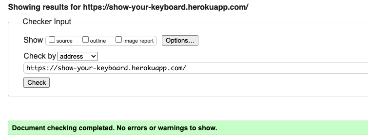    

Posts view.        
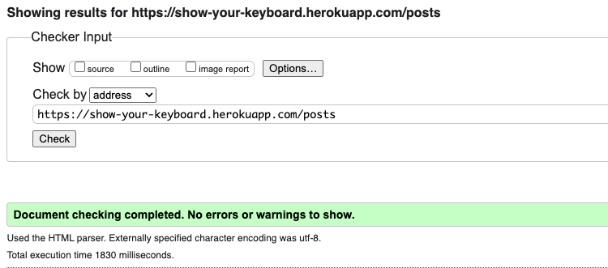

Postdetails   
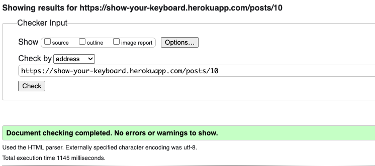    

Profile   
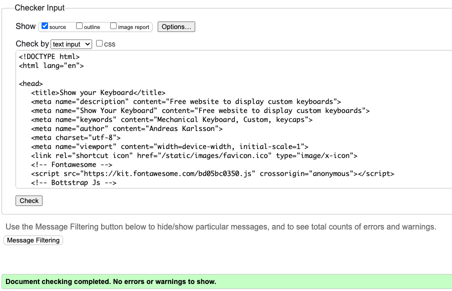  

Create post  
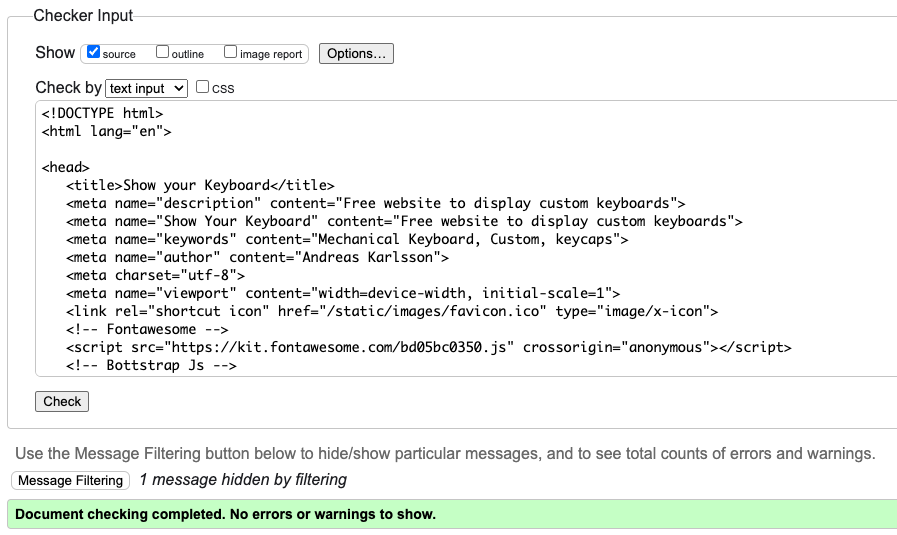  

Register (shows 4 errors but thats code directly from django's form, see image below)   
  
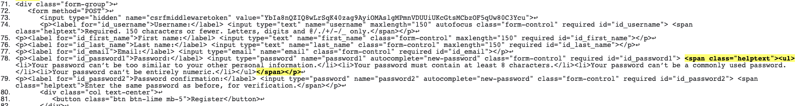    

Login.     
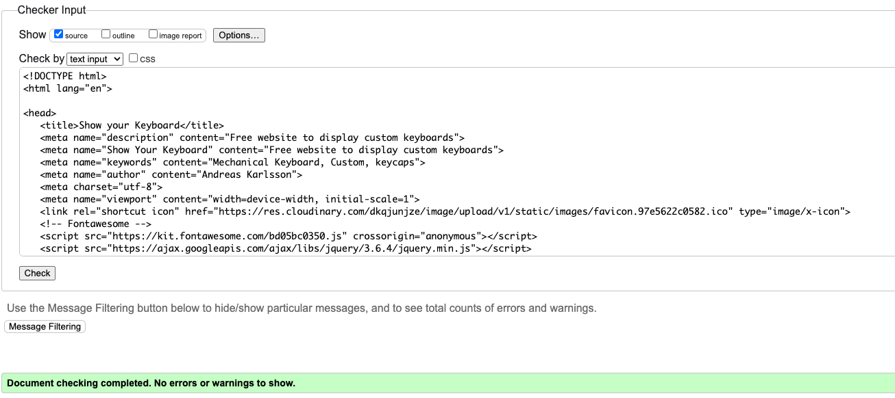    

Error 403.     
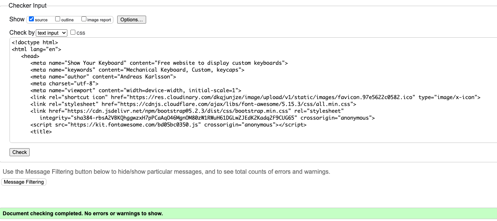  

Error 404.    
  

Error 500.    
  

_____________________________________________________________________________

### W3 CSS Checker

_____________________________________________________________________________

### Contrast Checker
Used a11ys Color contrast validator [Link](https://color.a11y.com)   
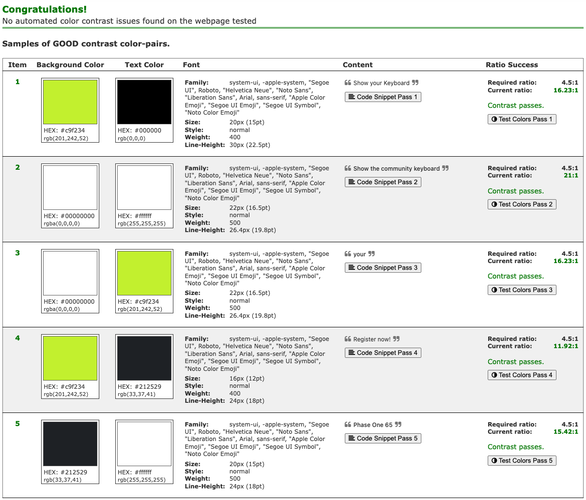    

WAVE Web Accessibility Evaluation Tool.   
(Contrast warnings noted, I have decided to keep it due to aesthetics)   
Lighthouse shows accessibility very high, and that contradicts this.     
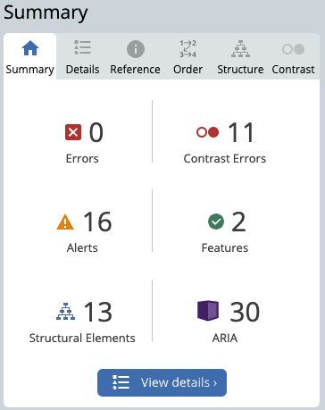
_____________________________________________________________________________

### Lighthouse
Scores from googles Lighthouse are below.     
Much of the low performance seem to be due to the host heroku, nothing i can fix myself. 
Result using Chrome and inkognito mode displays an increase in performence significantly.

#### Mobile
Index.html.    
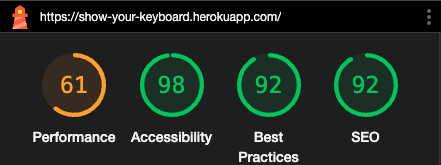     

Posts.    
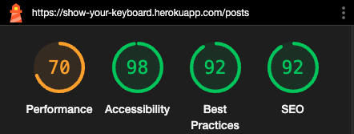    

Post details.     
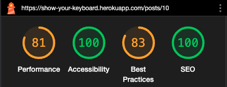    

Login.        
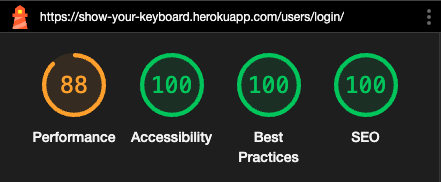 

Profile.       
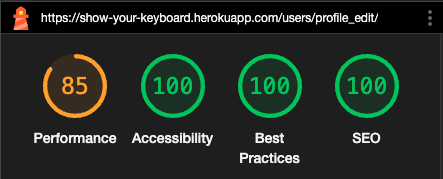 

Register.        
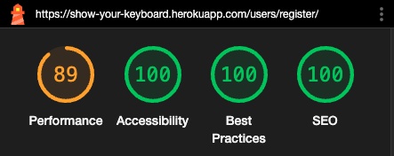 

_____________________________________________________________________________

#### Desktop
Index.html.     
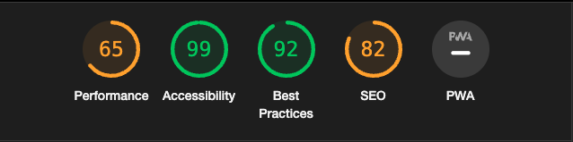

Posts.   
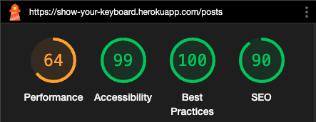     

Post details.    
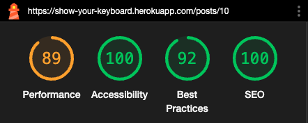    

Register.   
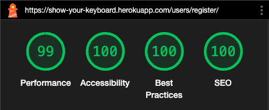     

Profile.    
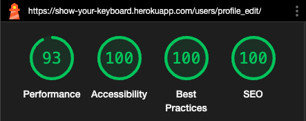    

Login.       
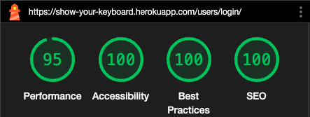 

_____________________________________________________________________________

### Rensponsiveness and further testing

- All done and registered in my Google todo docs, bugs also logged in my Kanban board under projects on Git Hub.   
Below is a screenshot snippet from the google docs, please click the link to see the entire document.   
[Link to google docs](https://docs.google.com/spreadsheets/d/1s44J9bTQyVY0vnPAtlb3FIwGDRyj-bNHVxq4E8CToME/edit?usp=sharing)    
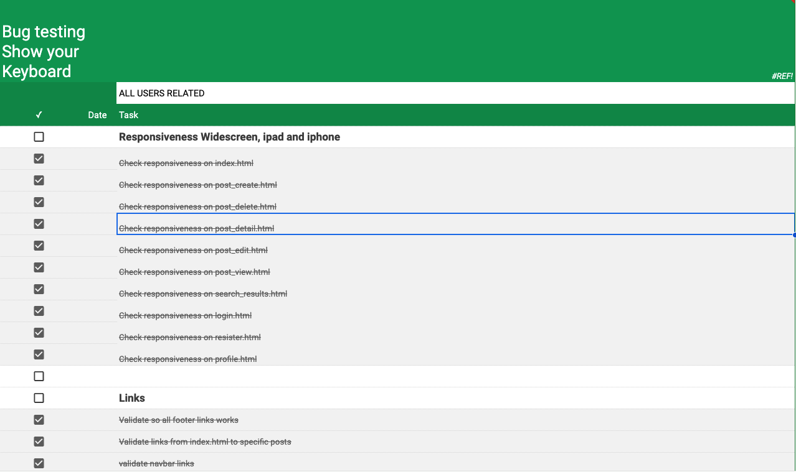    

_____________________________________________________________________________

### Full project board with bugs [Link](https://github.com/users/andreas-ka/projects/6/views/1)     
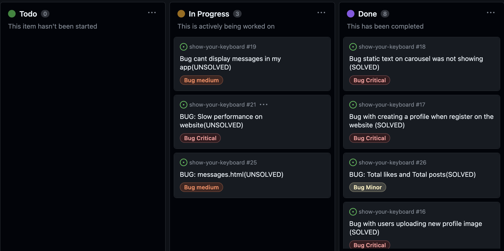   

_____________________________________________________________________________

### PEP8
### home app
home forms.py.    
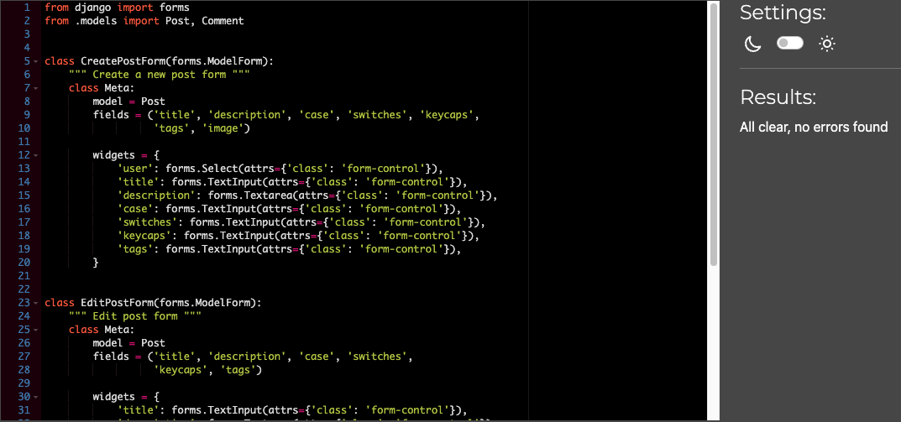     
home models.py.   
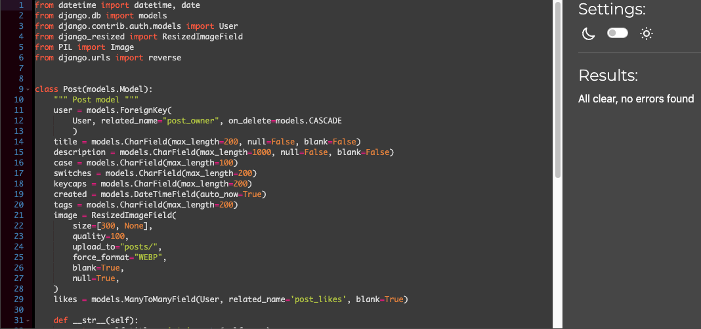     
home views.py.   
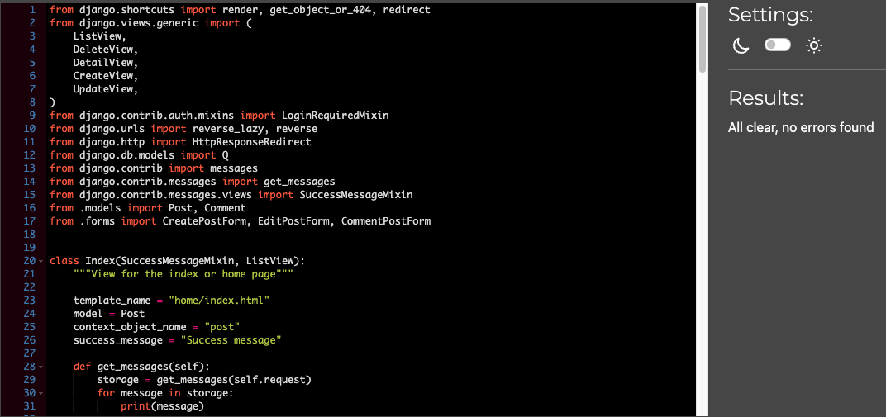   
home urls.py.  
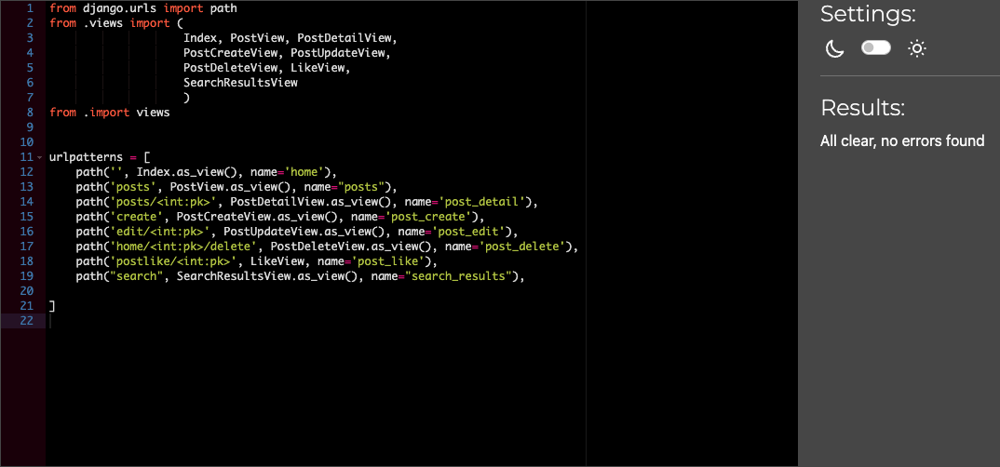    
_____________________________________________________________________________

#### Project
Project settings.py (note that some lines need to remain to long)    
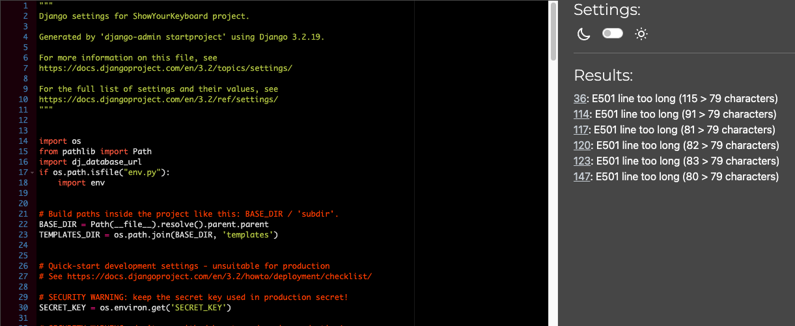    
Project urls.py.  
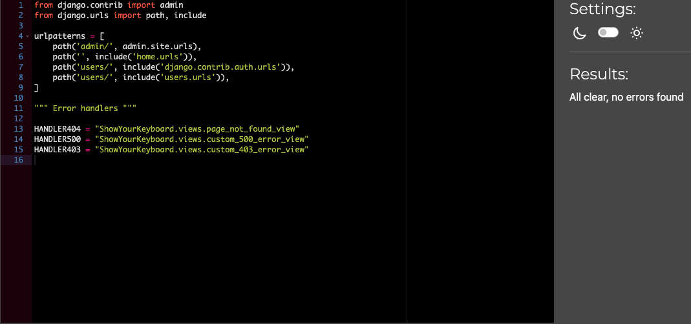    
Project views.py.   
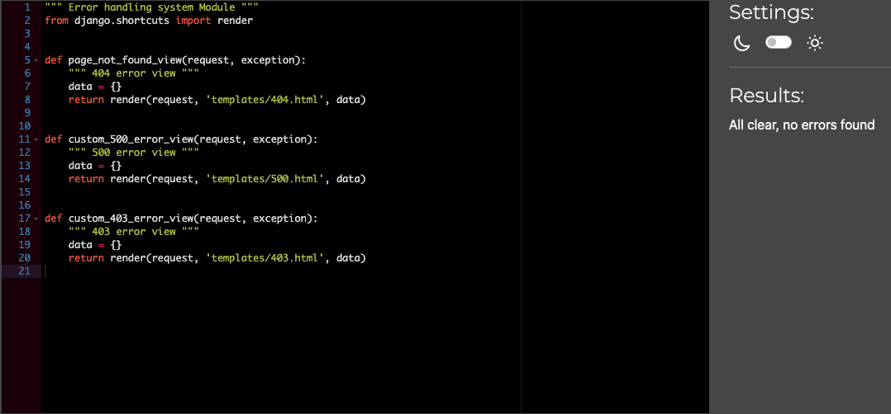    
_____________________________________________________________________________

#### users app
Users forms.py.    
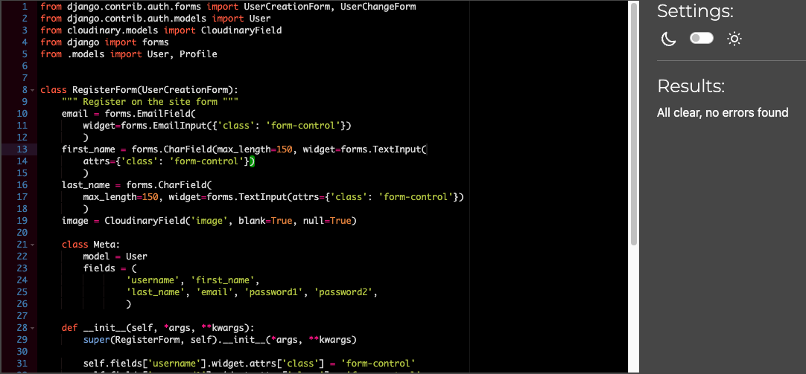   
Users models.py.     
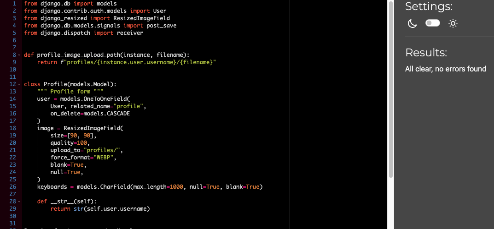     
Users urls.py.    
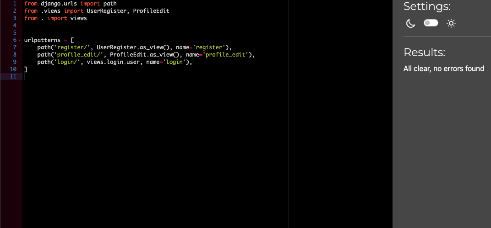    
Users views.py.   
   

[Back to Readme](README.md)