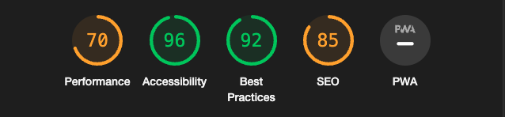
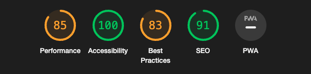
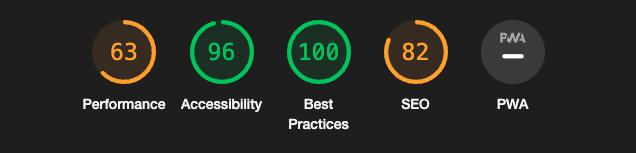

# Show your Keyboard

Below you will find all my tests on this project.

### PEP8

### W3 HTML Checker
Index.html.    
    

Posts view.        

Postdetails   
    

### W3 CSS Checker

### Contrast Checker
Used a11ys Color contrast validator [Link](https://color.a11y.com)   

### Lighthouse
Scores from googles Lighthouse below, worth noticing is that i supply the 3 pages that contains 
images and more loading, register, login and profile page only contains forms.    

#### Mobile
Index.html.    
     

Posts.    
    

Post details.     
    

#### Desktop
Index.html.     

Posts.   
     

Post details.    
    

### Rensponsiveness and further testing

- All done and registered in my google todo docs, bugs also logged in my kanban board under projects on github.   
Below is a screenshot snippet from the google docs, please click link to see the full document.   
[Link to google docs](https://docs.google.com/spreadsheets/d/1s44J9bTQyVY0vnPAtlb3FIwGDRyj-bNHVxq4E8CToME/edit?usp=sharing)    
   
Project boards with bugs [Link](https://github.com/-ka/projects/6)    

[Back to Readme](README.md)