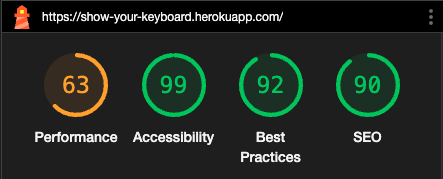
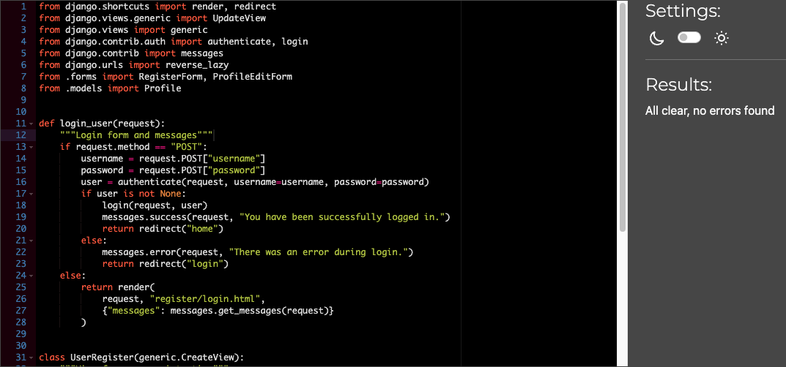

# Show your Keyboard

I've included for you below all my tests on this project.

_____________________________________________________________________________

### W3 HTML Checker
Done by choosing "View Page Source" and past in on the W3 HTML checker.    

Index.html.    
    

Posts view.        

Postdetails   
    

_____________________________________________________________________________

### W3 CSS Checker

_____________________________________________________________________________

### Contrast Checker
Used a11ys Color contrast validator [Link](https://color.a11y.com)   
    

WAVE Web Accessibility Evaluation Tool.   
(Contrast warnings noted)    

_____________________________________________________________________________

### Lighthouse
Scores from googles Lighthouse below, worth noticing is that I supply the three pages that contain 
images and more loading, the register, login and profile page only includes forms.   
Much of the low performance seem to be due to the host heroku, nothing i can fix myself. 
Result using Chrome and inkognito mode displays an increase in performence significantly.

#### Mobile
Index.html.    
     

Posts.    
    

Post details.     
    

_____________________________________________________________________________

#### Desktop
Index.html.     

Posts.   
     

Post details.    
    

_____________________________________________________________________________

### Rensponsiveness and further testing

- All done and registered in my Google todo docs, bugs also logged in my Kanban board under projects on Git Hub.   
Below is a screenshot snippet from the google docs, please click the link to see the entire document.   
[Link to google docs](https://docs.google.com/spreadsheets/d/1s44J9bTQyVY0vnPAtlb3FIwGDRyj-bNHVxq4E8CToME/edit?usp=sharing)    
    

_____________________________________________________________________________

### Full project board with bugs [Link](https://github.com/users/andreas-ka/projects/6/views/1)     
Worth noticing is that i have now a new column "Not Solvable", it contains a bug regarding "messages"   
that will not unfortunally be solved. Neither tutor or stackoverflow have been able to help or official documentation.    
   

_____________________________________________________________________________

### PEP8
### home app
home forms.py.    
     
home models.py.   
     
home views.py.   
   
home urls.py.  
    
_____________________________________________________________________________

#### Project
Project settings.py (note that some lines need to remain to long)    
    
Project urls.py.  
    
Project views.py.   
    
_____________________________________________________________________________

#### users app
Users forms.py.    
   
Users models.py.     
     
Users urls.py.    
    
Users views.py.   
   

[Back to Readme](README.md)